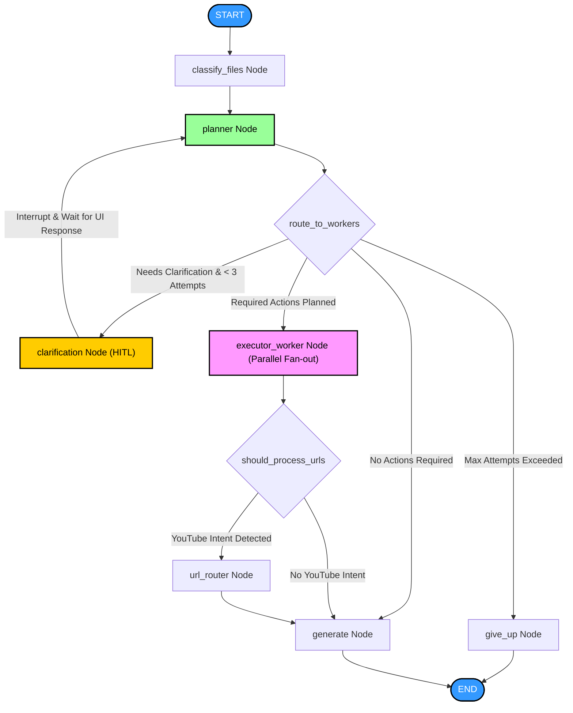

# Multimodal Agent: LangGraph-Powered RAG System

A state-of-the-art Multimodal RAG (Retrieval-Augmented Generation) Agent built using **LangGraph**, **FastAPI**, and **React (Vite)**. The agent orchestrates dynamic execution plans to analyze, transcribe, retrieve, and search across multiple file types (PDFs, Audio, Images) and external content (Web Searches, YouTube transcripts) with built-in human-in-the-loop clarification.

---

## 1. System Logic & Workflow

The system is modeled as a state machine using LangGraph. The conversation flow begins at a start state and dynamically routes tasks depending on user query intent, uploaded file metadata, and external content requirements.

### Workflow Flowchart

The agent graph structure designed and followed is represented below:

### Graph Nodes & Execution Steps

1. **`classify_files`** (handled by [classify_and_route]): Resets ephemeral working state `extracted_contents` to prevent state leakages across chat turns and inspects uploaded file extensions, categorizing them into `pdf_files`, `audio_files`, or `image_files` in the [AgentState].
2. **`planner`** (handled by [planner_node]): Calls a Groq LLM model (`llama-3.3-70b-versatile`) with structured JSON output matching [PlannerDecision] to map a sequence of actions (`required_actions`) containing the specific worker and operation required.
3. **`clarification`** (handled by [clarification_node]): Implements **Human-In-The-Loop (HITL)** using LangGraph `interrupt`. If a query is completely ambiguous and no files are uploaded, graph execution halts and yields control back to the UI. The user's clarification answer is sent to resume the graph.
4. **`executor_worker`** (handled by [executor_worker_node]): Performs parallel execution (fan-out) based on the actions planned. Special worker pipelines execute specific tasks:
   - **`pdf_worker`**: Performs full text parsing (with auto-summarization if token limits are exceeded) or does embedding-based context retrieval via pgvector.
   - **`audio_worker`**: Transcribes audio and splits large files dynamically.
   - **`image_worker`**: Extracts visual context using Llama 4 Vision.
   - **`web_worker`**: Runs external web searches.
5. **`url_router`** (handled by [url_router_node]): Discover URLs embedded within parsed PDF documents. If YouTube links are found, an intent classifier checks whether the user query explicitly requested YouTube analysis before routing to fetch transcripts.
6. **`generate`** (handled by [generate_node]): The synthesis engine that merges all compiled results and builds the final response. If documents were pre-summarized due to context constraints, it notes it for transparency.
7. **`give_up`** (handled by [give_up_node]): A fallback node triggered when clarification attempts exceed a threshold, ending the execution flow gracefully.

---

## 2. Tools Implemented with Async Programming

To ensure high performance, responsiveness, and maximum throughput, blocking operations are isolated and async execution is implemented across the codebase:

### 1. Dynamic Parallel Executor Fan-out (`route_to_workers` & LangGraph `Send`)
In [fanout.py], instead of processing worker actions sequentially, the system leverages LangGraph's dynamic `Send` primitive. This spawns multiple instances of `executor_worker_node` concurrently for each entry in `required_actions`.
- **Async Benefit**: Allows a PDF retrieval task, an audio transcription task, and a web search task to run **simultaneously**, cutting execution time down to the slowest single operation.

### 2. Large Audio Chunking & Concurrent Transcription (`transcribe_audio`)
In [audio_tools.py], if an audio file exceeds the `MAX_CHUNK_MB` limit:
- It runs `split_audio_ffmpeg` (a blocking subprocess execution) offloaded to a thread using `asyncio.to_thread`.
- Transcription tasks for all audio chunks are fired concurrently using a `ThreadPoolExecutor`.
- The synchronous Groq transcriptions execute in parallel across worker threads, and their results are collected, sorted, and merged back.

### 3. CPU-Bound & Synchronous Network I/O Thread Offloading
To prevent blocking the FastAPI Event Loop, synchronous library calls are wrapped using `asyncio.to_thread`:
- **PDF Extraction**: [pdf_parser] runs the synchronous `PyPDFLoader` within a separate thread.
- **YouTube Captions**: [youtube_transcript_tool] offloads transcripts fetching and listing (`YouTubeTranscriptApi`) to background threads.
- **Text Chunking**: In [vector_store.py], splitting text with `RecursiveCharacterTextSplitter` is offloaded to threads.
- **Sentence Embeddings**: Embedding generation via HuggingFace `all-MiniLM-L6-v2` (`embed_documents`/`embed_query`) runs in background threads to avoid blocking.

### 4. Async Map-Reduce Summarizer (`map_reduce_summarizer`)
In [summarizer.py], when summarization of a large source is required:
- The text is chunked into standard segments.
- Each segment's LLM prompt is mapped to an async task.
- `asyncio.gather(*map_tasks)` is called to resolve all map operations **concurrently**, followed by an async reduce synthesis call.

### 5. Async Database Operations (Neon PostgreSQL & Upstash Redis)
- **`asyncpg` Pool**: [connection.py] maintains an async connection pool.
- **Upstash Redis**: [cache.py] utilizes `upstash_redis.AsyncRedis` for non-blocking HTTP-based cache hits and writes.

### 6. Event-Driven SSE Chat Stream API & Client
- **FastAPI Endpoint**: The `/chat/stream` API uses an async generator (`async for event in graph.astream(...)`) to stream token chunks and graph states.
- **React Frontend Client**: The JS client in [chat.js] uses `fetch` and custom readable stream readers (`reader.read()`) to decode incoming SSE buffers in a non-blocking `while (true)` loop.

---

## 3. System Design & Resilience Patterns

Several robust system design patterns are implemented to build an enterprise-ready, reliable, and optimized system:

### 1. Resilient LLM and API Retries (Exponential Backoff with Jitter)
Implemented in [retry.py] using the `tenacity` framework:
- **Error Classification**: The function `is_retryable` separates transient network errors and rate limits (HTTP 429, 500, 502, 503, 504, connection timeouts) from permanent client errors (HTTP 400, 401, 403, 404).
- **Exponential Backoff & Jitter**: Retries are configured with `wait_exponential` combined with `wait_random` (jitter). This avoids the *thundering herd problem* where failed calls retrying simultaneously swamp target endpoints.
- **Unified Wrappers**: `async_llm_retry` and `async_api_retry` dynamically handle both coroutines and standard callable objects.

### 2. Multi-Tiered Caching
The application implements two separate caching strategies in [cache.py] backed by Upstash Redis:
- **Redis-First Document Index Cache (Fast Path)**: When checking if a document is already embedded and stored in PostgreSQL, the system checks Redis first (`is_document_indexed`). This avoids costly PostgreSQL roundtrips.
- **Write-Through Warming**: Upon successful Postgres chunk insertion, `mark_document_indexed` immediately writes to Redis to warm the cache.
- **LLM Response Caching**: Intermediate heavy operations (such as chunk summaries) are SHA-256 hashed and cached in Redis for 24 hours.

### 3. Persistent Graph Session Checkpointers (Neon Postgres)
In [main.py]:
- The compiled LangGraph graph uses `AsyncPostgresSaver` backed by Neon PostgreSQL database as its persistent checkpointer.
- The checkpointer automatically runs `setup()` to dynamically construct tables if they are missing.
- **Design Benefit**: Chat sessions survive server restarts and crashes. Users can return to their active thread IDs at any time.

### 4. High-Throughput Database Operations
In [vector_store.py]:
- Multi-vector document inserts are performed using `executemany` inside pgvector, minimizing DB network roundtrips.
- Semantic RAG lookup uses the cosine distance operator (`<=>`) for vector calculations directly inside the SQL engine.

### 5. Context Window Guardrails & Token Optimization
- **`CHAR_LIMIT` Guardrail**: To protect the system against context window overflow, any input source exceeding 20,000 characters is automatically redirected through the Map-Reduce summarizer.
- **`was_summarized` Flag**: Downstream nodes receive metadata indicating whether a source is a summary or a full text, prompting them to synthesize responses correctly without hallucinating knowledge.
